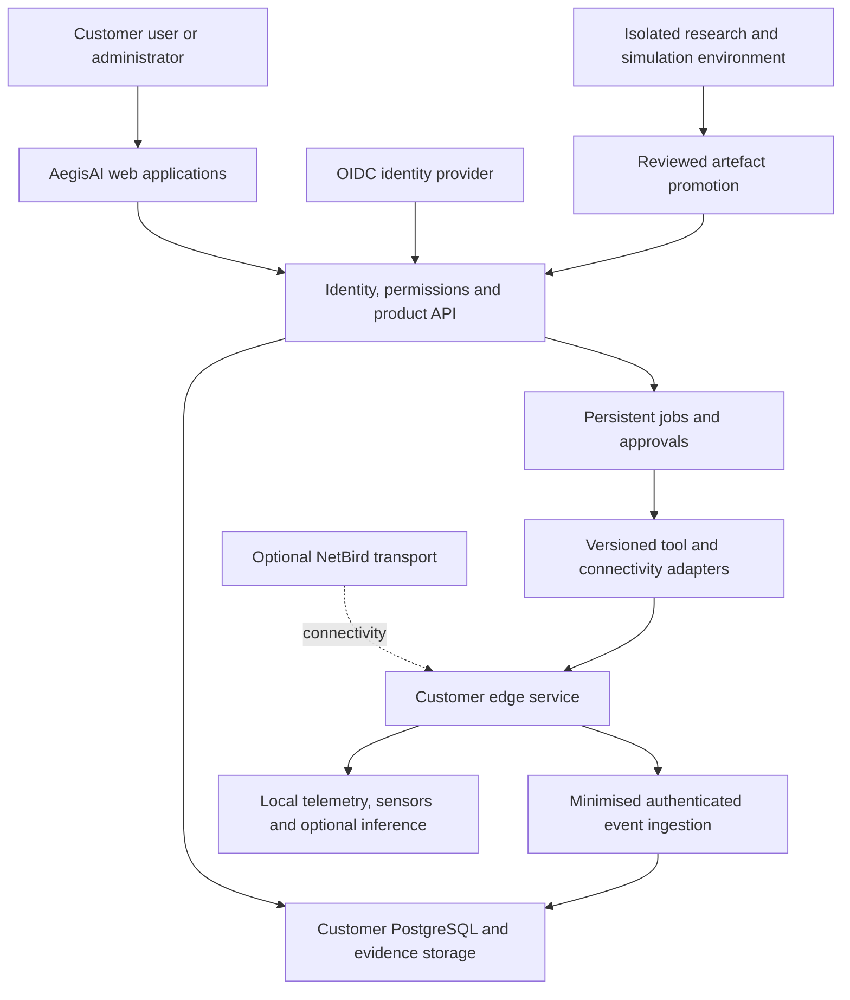

# Shared architecture

[Index](README.md) · Specification, not deployed software · Owner: Platform/Security Lead

## Deployment and ownership

Start with a customer-isolated EU Linux deployment: React/TypeScript web application, Python/FastAPI modular API, PostgreSQL, object storage, and asynchronous workers. Use OIDC for customer identity; application authorisation is independent of the identity provider. Use container images and infrastructure-as-code. A PostgreSQL-backed job queue/outbox is sufficient initially; do not add a message broker or distributed workflow engine without an observed requirement.

One customer stack contains its own application database, storage namespace/credentials, encryption boundary and optional NetBird deployment. Shared fleet administration stores deployment health and billing metadata only. Cross-customer administrative access requires time-bounded elevation and an audit trail. Production, staging and research use different credentials and networks.

The diagram shows logical connections, not permission to make every route bidirectional. Edge ingestion is outbound initiated. A sensor interface must not become a route from a sandbox to customer production.

## Product modules

Learning manages content, assignments and outcomes. Operations manages assets, components, observations, findings and investigations. Validation manages scoped test plans and results. Agent Security manages workload identity, tool policy and execution. Shared services handle organisations, audit, approvals, entitlements, evidence references and jobs. Disabling one product must not break another's login, evidence access or scheduled processing.

## Data flow and minimisation

1. An enrolled source authenticates with a revocable workload credential, never an administrator token.
2. A collector validates and classifies records locally, removing prohibited fields before export.
3. Ingestion validates a versioned envelope, deduplicates by producer/event identity, stores provenance and acknowledges durable receipt.
4. Rules or evaluated models produce findings with evidence references and model/rule versions.
5. An authorised user reviews a proposed action. Execution checks approval scope and current target state immediately before acting.
6. A follow-up observation records success, failure, uncertainty or required manual recovery.

Default handling: raw packet payloads disabled; locally buffered metadata expires after seven days; centrally stored operational observations expire after 30 days; findings/audit after 180 days; learning outcomes after 180 days. These are pilot design defaults, configurable through a documented customer-purpose/retention review. Research copies require separate approval and retention. Pseudonymisation is not anonymisation. Backup expiry and restore-time deletion replay are covered in the [privacy specification](11-security-privacy-regulation.md).

## Build, reuse and defer

| Capability | Initial decision | Reason/revisit trigger |
|---|---|---|
| Evidence/finding model, UX, workflows | Build | Own-product differentiation |
| Networking | Optional upstream NetBird behind adapter | Avoid bespoke tunnel/security maintenance; revisit only for a measured gap |
| Authentication | OIDC integration | Separate authentication from authorisation; pilot IdP selected from actual customer environment |
| SCA | CycloneDX JSON ingestion + OSV enrichment adapter | Reuse standards and advisories; preserve provenance and freshness |
| Network monitoring | Evaluate Zeek metadata and Suricata alerts in lab | Reuse sensors; AegisAI owns normalisation and findings |
| Workflow | Persistent jobs, retries, outbox and approval records | Introduce Temporal only if durable workflow complexity exceeds this implementation |
| Observability | OpenTelemetry instrumentation; standard metrics/log collection | Correlate execution without logging secrets or full prompts by default |
| Model serving | Adapter; local runtime benchmark before selection | No unverified GPU purchase or latency promise |
| User interface | Responsive web first | Native mobile/Electron only for demonstrated unmet workflows |
| Storage/scale | PostgreSQL and object storage | No data lake, Kafka or Kubernetes as a release prerequisite |

Standards/provider context: [CycloneDX](https://cyclonedx.org/specification/overview/), [OSV](https://osv.dev/). Pin versions and verify licences in the implementation change that adopts each dependency.

## Failure and security boundaries

- Queue interruption: resume persisted jobs; require idempotency or reconciliation for external side effects. Never blindly retry an uncertain account-disable operation.
- Collector offline: bounded local buffer, visible last-seen timestamp, no fabricated normal status; overflow records a loss count.
- Model unavailable: deterministic baseline/reporting continues; mark model-generated enrichment unavailable.
- External feed stale: show age and last success; missing advisories are not evidence of no vulnerabilities.
- Compromised agent: isolate execution, revoke credentials, preserve audit, disable tool capability without disabling unrelated customer networking.
- Network management outage: expose stale policy state; do not promise immediate revocation until enforcement is confirmed.
- Storage pressure: stop optional capture first; preserve audit integrity and alert the operator.

Platform tests cover cross-organisation references, duplicate events, schema mismatch, stale credentials, interrupted upgrades and backup restoration. Concrete gate evidence is defined in the [production handbook](12-production-handbook.md).
